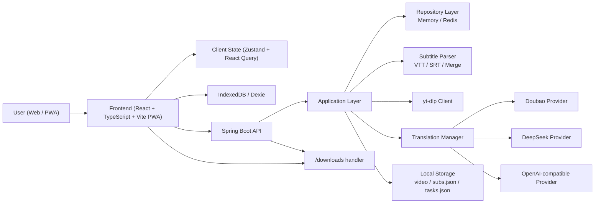
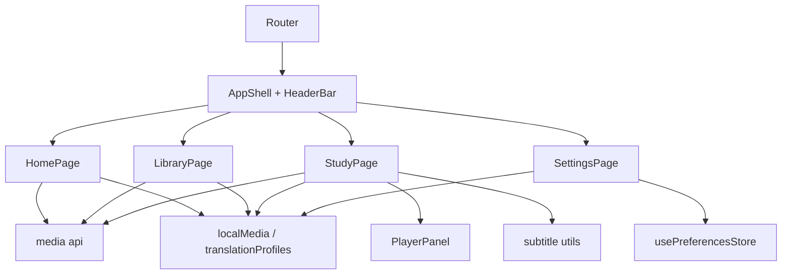

# Smart VELP PRD v2

## 1. Product Overview

### 1.1 Product Name

Smart VELP

### 1.2 One-line Positioning

Smart VELP is a cross-platform video language learning workspace that supports online videos, local videos, subtitle-driven study, and user-owned LLM translation profiles.

### 1.3 Target Platforms

- Web
- PWA
- Windows browser
- iPhone Safari / iPad Safari
- Android browser

This phase targets Web/PWA first. Native shells are future work.

## 2. Problem Statement

Users who learn from videos usually hit the same problems:

- Content is fragmented across YouTube, local files, and subtitle tools.
- Translation quality is not controllable.
- Most products do not let users bring their own model, API key, or translation direction.
- Learning actions are scattered across multiple screens and tools.
- Mobile and desktop experiences are inconsistent.
- Existing subtitle study tools are either too technical or too limited.

## 3. Product Goals

### 3.1 Primary Goals

- Unify online video study and local video study in one product.
- Make subtitle study the center of the learning experience.
- Let users control source language, target language, and LLM provider profile.
- Deliver a clean, low-friction, responsive Web/PWA experience.

### 3.2 Non-goals for This Phase

- Multi-user collaboration
- Cloud account sync
- Native mobile or desktop app packaging
- Recommendation engine
- Social features

## 4. Target Users

### 4.1 Core Users

- Learners who study from YouTube or local video files
- Users who want better subtitle-assisted comprehension
- Users who care about model choice and translation quality

### 4.2 Advanced Users

- Users who want to reuse their own LLM API keys
- Users learning languages beyond English
- Users who want to retranslate the same material multiple times

## 5. Core Value Proposition

- Bring your own content
- Bring your own model
- Study with subtitles, not with clutter
- Continue seamlessly across screen sizes

## 6. Core User Flows

### 6.1 Online Video Flow

1. User pastes a video URL.
2. Backend creates a parse task.
3. Backend downloads video and subtitles.
4. Backend merges or generates subtitles.
5. User opens the study page.
6. User studies with source/target subtitle modes.
7. User can retranslate the course later.

### 6.2 Local Video Flow

1. User imports a local video.
2. User optionally imports a local subtitle file.
3. Frontend stores the local asset metadata.
4. If subtitle exists, frontend can trigger backend subtitle retranslation.
5. User studies the local content immediately.

### 6.3 Local Subtitle-only Flow

1. User imports subtitle only.
2. Frontend submits subtitle text to backend.
3. Backend parses and retranslates subtitle content.
4. User studies it as a subtitle-only session.

### 6.4 Course Retranslation Flow

1. User opens an existing course.
2. User changes language direction or model profile.
3. User triggers retranslation.
4. Backend creates a retranslation task.
5. Updated subtitle result replaces the previous target text.

## 7. Functional Requirements

### 7.1 Content Ingestion

- Support online video URL submission
- Support local `mp4` / `mov` upload
- Support local `srt` / `vtt` upload
- Support subtitle-only upload and processing

### 7.2 Learning Page

- Video playback
- Subtitle list with sentence navigation
- Subtitle modes:
  - dual
  - source only
  - target only
  - hidden
- Playback rate control
- Subtitle font size control
- Sentence loop mode
- Fullscreen mode
- Video download

### 7.3 Translation

- User-configurable source language
- User-configurable target language
- Runtime translation provider selection
- Runtime translation model selection
- Runtime API key usage
- Course retranslation
- Local subtitle retranslation

### 7.4 Settings

- Theme mode:
  - system
  - light
  - dark
- Auto-download toggle
- Language direction settings
- Local model profile management

### 7.5 Library

- Online task list
- Local imported content list
- Task status display
- Failed task cleanup
- Local subtitle task progress display

### 7.6 PWA

- Installable manifest
- Offline shell support
- Service worker registration
- Update-ready architecture

## 8. Non-functional Requirements

### 8.1 UX

- Mobile, tablet, and desktop responsive layouts
- Low visual clutter
- Clear CTA hierarchy
- No blocking friction for first-use flows

### 8.2 Reliability

- Tasks must expose processing state
- Failures must return readable messages
- Local content should remain available even if remote translation fails

### 8.3 Security

- User API keys must not be stored on the backend in this phase
- API keys are stored locally with browser-side encryption
- Hardcoded secret values must be removed from repo-managed config

### 8.4 Maintainability

- Frontend should remain modular and route-based
- Backend translation contract should converge on a general subtitle model
- Task orchestration should reuse shared flow patterns

## 9. Information Architecture

### 9.1 Pages

- Home
- Library
- Study
- Settings

### 9.2 Page Roles

- Home: primary actions and continue-learning entry
- Library: online and local content management
- Study: playback and subtitle learning workspace
- Settings: themes, language direction, translation profiles

## 10. Product Decisions

### 10.1 Web-first Strategy

This phase is Web/PWA-first because:

- Existing architecture is already web-based.
- It reaches all major target platforms fastest.
- It keeps the product surface small while learning what users actually need.

### 10.2 Translation Ownership

User owns the model profile:

- provider
- baseUrl
- model
- apiKey

The system owns:

- task orchestration
- subtitle parsing
- retranslation workflow
- study UI

## 11. Technical Architecture



## 12. Frontend Architecture



## 13. Backend Architecture

### 13.1 Main Modules

- `MediaController`
- `MediaApplicationService`
- `TranslationManager`
- `SubtitleFileParser`
- `YtDlpClient`
- `MediaRepository`

### 13.2 Current Transition State

Backend is currently transitioning from:

- legacy subtitle semantics: `en/cn`

to:

- general subtitle semantics: `sourceText/targetText/sourceLang/targetLang`

This transition must complete in later milestones.

## 14. Canonical Data Model Direction

### 14.1 Subtitle Domain Object

Target canonical structure:

```json
{
  "startTime": 12.5,
  "endTime": 14.2,
  "sourceText": "How are you doing?",
  "targetText": "你最近怎么样？",
  "sourceLang": "en",
  "targetLang": "zh-CN"
}
```

### 14.2 Compatibility Policy

- Existing `en/cn` fields remain readable during migration.
- New write paths should increasingly prefer `source/target`.
- DTOs should expose the general model first.

## 15. API Surface v2

### 15.1 Existing or Current Core Endpoints

- `POST /api/parser/analyze`
- `POST /api/parser/local-subtitles`
- `GET /api/parser/status/{taskId}`
- `GET /api/parser/tasks`
- `DELETE /api/parser/tasks/{taskId}`
- `DELETE /api/parser/tasks/failed`
- `GET /api/course/{videoId}/detail`
- `GET /api/course/{videoId}/download`
- `POST /api/course/{videoId}/retranslate`

### 15.2 Runtime Translation Payload

All translation-capable flows should accept:

- `sourceLang`
- `targetLang`
- `translationProfile.provider`
- `translationProfile.baseUrl`
- `translationProfile.model`
- `translationProfile.apiKey`

## 16. Acceptance Criteria

### 16.1 MVP Stability Criteria

- Online URL flow works end-to-end
- Local video + subtitle flow works end-to-end
- Subtitle-only flow works end-to-end
- Course retranslation works end-to-end
- Study page supports source/target mode switching
- PWA build succeeds
- Backend compile succeeds

### 16.2 Product Quality Criteria

- No broken layout on mobile/tablet/desktop breakpoints
- No visible garbled Chinese on major screens
- Clear empty, loading, and error states
- No hidden dependency on server-side secret configuration for user-supplied models

## 17. Risks

- Legacy `en/cn` compatibility may prolong backend complexity
- Some Chinese copy still needs systematic cleanup
- PWA is installable but still light on runtime UX polish
- No automated test baseline yet
- Current repo still contains technical debt in deployment and security posture

## 18. Evolution Direction

### Phase A

- Finish UI cleanup
- Finish subtitle model convergence
- Stabilize all task flows

### Phase B

- Add testing and release gates
- Improve PWA install/update/offline UX
- Improve reliability and observability

### Phase C

- Add user accounts and cloud sync
- Add review tools: saved lines, vocabulary, spaced repetition
- Consider native shell packaging

